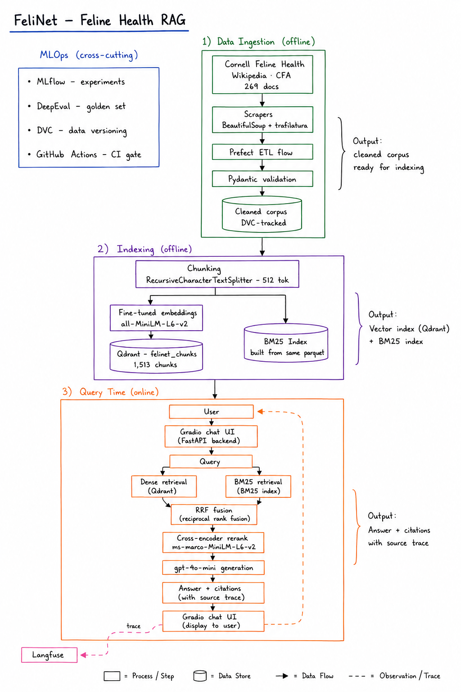

# FeliNet 🐱

A feline health and breed knowledge assistant powered by a deep RAG pipeline with full MLOps infrastructure.


**[Live demo](https://huggingface.co/spaces/exzm/felinet)** · **[Source](https://github.com/exzm09/felinet)**

## What is this?

FeliNet is an open-source RAG system built over a curated corpus of veterinary and breed information. It combines:

- **Hybrid search** (BM25 + dense retrieval with reciprocal rank fusion)
- **Cross-encoder reranking** for precision
- **Fine-tuned domain embeddings** on feline veterinary text
- **Guardrailed LLM generation** with source citations
- **Full MLOps stack**: experiment tracking, data versioning, CI/CD quality gates, observability, and drift detection

## Results

Measured on a held-out 50-case golden set (disease, breed, nutrition, behavior, toxicology).

### Fine-tuning the embeddings was the biggest win

| Retrieval metric | Baseline (all-MiniLM-L6-v2) | Fine-tuned (felinet-v1) | Improvement |
|---|---|---|---|
| NDCG@10 | 0.680 | 0.785 | +10.4% |
| MRR@10 | 0.619 | 0.726 | +10.7% |
| Accuracy@1 | 0.481 | 0.581 | +10.0 pts |
| Accuracy@5 | 0.795 | 0.921 | +12.6 pts |
| Accuracy@10 | 0.869 | 0.962 | +9.3 pts |

### End-to-end quality

| Metric | Value |
|---|---|
| Source accuracy | 96.0% |
| Faithfulness | ~0.90 |
| Answer relevancy | 0.97–1.00 |
| Error rate | 0.0% (down from 34% pre-migration) |
| Avg / P95 latency | 2437 ms / 4773 ms |

## Architecture


## Project structure

```
felinet/
-- src/felinet/           # Source code
|   --  data/             # Ingestion, scraping, ETL
|   --  rag/              # Retrieval, reranking, generation
|   --  embeddings/       # Chunking + fine-tuning (index-time)
|   --  api/              # FastAPI endpoints
|   --  evaluation/       # DeepEval / RAGAS test suites
|   --  experiments/      # A/B testing
|   --  mlops/            # Experiment-tracking helpers
|   --  monitoring/       # Drift, alerts, query logging
|   --  schemas.py        # Pydantic data models
|-- tests/                # Unit and integration tests
|-- configs/              # YAML configuration files
|-- data/                 # DVC-tracked data (not in git)
|-- scripts/              # One-off setup scripts
|-- docs/                 # Architecture docs and ADRs
```

## Quick start

```bash
# Clone and set up
git clone https://github.com/exzm09/felinet.git
cd felinet
python -m venv .venv
.\.venv\Scripts\Activate.ps1
pip install -e ".[dev]"

# Copy and fill in environment variables
copy .env.example .env

# Verify MLflow
python scripts/init_mlflow.py
mlflow ui --port 5000

# Run tests
pytest -q -p no:deepeval
```

## Tech stack

| Layer | Tool |
|---|---|
| Embeddings | sentence-transformers (fine-tuned) |
| Vector store | Qdrant |
| Hybrid search | rank_bm25 + Qdrant dense + RRF |
| Reranking | cross-encoder/ms-marco-MiniLM-L-6-v2 |
| LLM | OpenAI (gpt-4o-mini) |
| API | FastAPI |
| Frontend | Gradio |
| Experiment tracking | MLflow |
| Data versioning | DVC |
| Observability | Langfuse |
| CI/CD | GitHub Actions + DeepEval |
| Orchestration | Prefect |

## License

MIT
